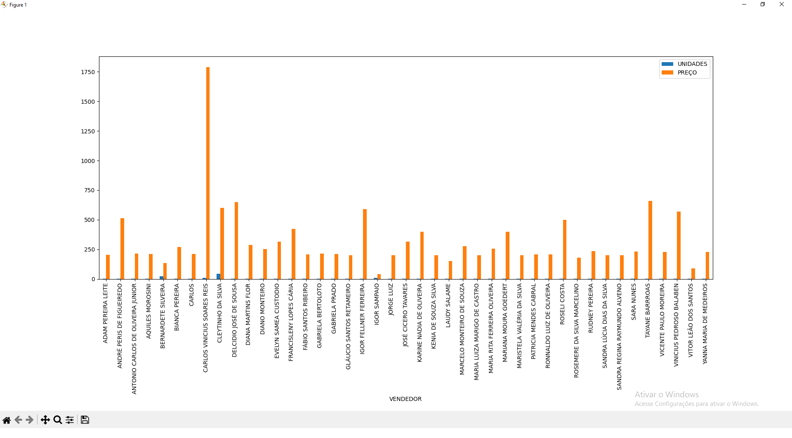

# Automatização de relatórios (planilhas Excel)

- Sistema utilizado para fazer a busca em de dados nas planilhas mesmo estando em planilhas separadas 
- Após a coleta de dados faz a soma e junta todas as informções em uma única planilha
- Finaliza mostrando um gráfico de sua preferência




Install libs

```bash
  pip install -r requirements.txt
```

Run Project
```bash
  python3 controle.py
  OR
  python controle.py
```